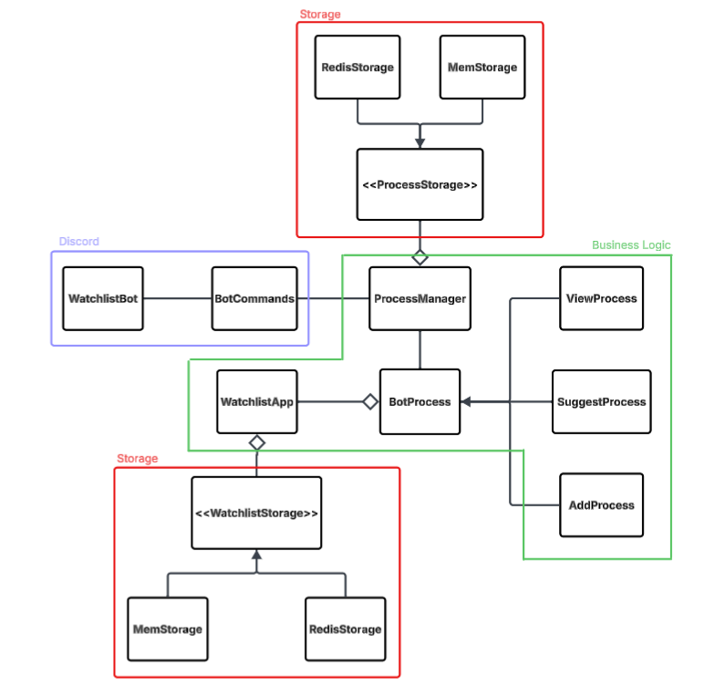

# Watchlist Bot — DevOps Final Project

 

A Discord bot for managing personal movie and TV show watchlists, wrapped in a full DevOps pipeline for the CSCI 220 final project.

---

## Table of Contents

- [Overview](#overview)
- [Architecture](#architecture)
- [Bot Commands](#bot-commands)
- [Dev Setup](#dev-setup)
- [Prod Setup](#prod-setup)
- [CI/CD](#cicd)
- [Technologies](#technologies)
- [Contributors](#contributors)
- [References](#references)

---

## Overview

This project applies DevOps practices to a pre-existing Java Discord bot originally built for CSCI 244. The bot lets Discord users manage a personal watchlist through a conversational interface — the focus here is the pipeline surrounding it:

| Practice                | Tool                            |
| ----------------------- | ------------------------------- |
| Source control          | Git + GitHub (cs220s26 org)     |
| Build & static analysis | Maven (Checkstyle + fat JAR)    |
| Secrets management      | AWS Secrets Manager             |
| Database                | Redis + setup scripts           |
| Production hosting      | AWS EC2 + SystemD               |
| Continuous Integration  | GitHub Actions (every push)     |
| Continuous Deployment   | GitHub Actions (manual trigger) |

---

## Architecture



---

## Bot Commands

| Command      | Description                                           |
| ------------ | ----------------------------------------------------- |
| `!watchlist` | View your watchlist (optionally filter by Movie/Show) |
| `!add`       | Add a new Movie or TV Show to your watchlist          |
| `!suggest`   | Filter your watchlist to find your next watch         |
| `!status`    | Check your current dialogue state                     |
| `!help`      | List all available commands                           |

---

## Dev Setup

### Prerequisites

- Java 21
- Maven
- Redis running locally on port 6379
- AWS credentials configured (`~/.aws/credentials`) with `secretsmanager:GetSecretValue` permission
- Discord bot token stored in AWS Secrets Manager (`us-east-1`)

### Steps

1. **Clone the repository**

   ```bash
   git clone https://github.com/cs220s26/LiamRanaIsaac.git
   cd LiamRanaIsaac
   ```

2. **Start Redis locally**

   ```bash
   # macOS (Homebrew)
   brew services start redis

   # Linux
   sudo systemctl start redis
   ```

3. **Build** — runs Checkstyle, compiles, and packages a fat JAR

   ```bash
   mvn clean package
   ```

4. **Run the bot**

   ```bash
   java -jar target/WatchlistBot-1.0.0-jar-with-dependencies.jar
   ```

5. **(Optional) Load starter media into Redis**

   ```bash
   ./scripts/addStarterMedia.sh
   ```

6. **(Optional) Reset Redis to a clean empty state**
   ```bash
   ./scripts/resetDB.sh
   ```

> **Note:** The bot loads its Discord token from AWS Secrets Manager, not a `.env` file. Local AWS credentials must be configured before running.

---

## Prod Setup

Production runs on an **AWS EC2** instance. Initial setup is fully automated via `scripts/userdata.sh`.

### First-Time Launch

1. **Launch an EC2 instance** (Amazon Linux 2, `t2.micro` or larger)
   - Attach an **IAM role** with `secretsmanager:GetSecretValue` permission
   - Paste the contents of `scripts/userdata.sh` into the **User Data** field under Advanced Details

   The script automatically:
   - Updates system packages
   - Installs Git, Redis 6, Maven, and Amazon Corretto 21
   - Clones the repository to `/LiamRanaIsaac`
   - Starts and enables Redis
   - Builds the project (`mvn clean package`)
   - Registers and starts the bot as a SystemD service

2. **Verify the service is running**
   ```bash
   sudo systemctl status watchlistbot
   ```

### Ongoing Operations

| Task                 | Command                        |
| -------------------- | ------------------------------ |
| Redeploy latest code | `./scripts/redeploy.sh`        |
| Reset Redis          | `./scripts/resetDB.sh`         |
| Load starter media   | `./scripts/addStarterMedia.sh` |

`redeploy.sh` runs `git pull origin main` → `mvn clean package` → `systemctl restart watchlistbot`.

---

## CI/CD

### Workflows

All four workflows live in `.github/workflows/`:

| File                      | Trigger          | What it does                              |
| ------------------------- | ---------------- | ----------------------------------------- |
| `tests.yaml`              | Every `git push` | Runs Checkstyle + JUnit tests             |
| `redeploy.yaml`           | Manual           | SSH into EC2 and run `redeploy.sh`        |
| `InjestStarterMedia.yaml` | Manual           | SSH into EC2 and run `addStarterMedia.sh` |
| `resetDB.yaml`            | Manual           | SSH into EC2 and run `resetDB.sh`         |

### GitHub Secrets

The SSH-based workflows authenticate using a secret stored in the repository:

1. Download your AWS Lab `.pem` private key file.
2. Go to **Settings → Secrets and variables → Actions → New repository secret**.
3. Name it **`LABSUSERPEM`** and paste the full `.pem` contents as the value.

### How CI Works

On every push, GitHub Actions:

1. Spins up an `ubuntu-latest` runner with Java 21 (Amazon Corretto) and Maven caching.
2. Runs `mvn test`, which validates Checkstyle, compiles, and runs all JUnit 5 tests.
3. Marks the workflow failed (blocking merges) on any violation or test failure.

### How CD Works

Triggered manually from the **Actions** tab:

1. GitHub Actions SSHes into EC2 using `LABSUSERPEM`.
2. Runs the relevant script on the remote instance.

---

## Technologies

| Technology                | Purpose                                    |
| ------------------------- | ------------------------------------------ |
| Java 21 (Amazon Corretto) | Primary application language               |
| Maven                     | Build automation and dependency management |
| Checkstyle                | Static code analysis                       |
| JUnit 5                   | Unit testing                               |
| Git / GitHub              | Version control and CI/CD hosting          |
| GitHub Actions            | CI/CD pipeline automation                  |
| AWS EC2                   | Cloud production server                    |
| AWS Secrets Manager       | Secure token/credential storage            |
| AWS SDK for Java v2       | Secrets Manager client library             |
| SystemD                   | Linux service manager                      |
| Redis                     | Key-value store for watchlist persistence  |
| Jedis                     | Java Redis client                          |
| JDA (Java Discord API)    | Discord bot framework                      |

---

## Contributors

- Liam Kerr
- Rana Yum
- Isaac Nunez

---

## References

- [GitHub Actions — setup-java](https://github.com/actions/setup-java)
- [GitHub Actions — appleboy/ssh-action](https://github.com/appleboy/ssh-action)
- [GitHub Actions — storing secrets](https://docs.github.com/en/actions/security-for-github-actions/security-guides/using-secrets-in-github-actions)
- [Maven Assembly Plugin (fat JAR)](https://maven.apache.org/plugins/maven-assembly-plugin/usage.html)
- [Maven Checkstyle Plugin](https://maven.apache.org/plugins/maven-checkstyle-plugin/usage.html)
- [AWS Secrets Manager — Java retrieval](https://docs.aws.amazon.com/secretsmanager/latest/userguide/retrieving-secrets_cache-java.html)
- [SystemD service unit file reference](https://www.freedesktop.org/software/systemd/man/latest/systemd.service.html)
- [EC2 User Data scripts](https://docs.aws.amazon.com/AWSEC2/latest/UserGuide/user-data.html)
- [Redis — getting started](https://redis.io/docs/latest/get-started/)
- [Jedis — getting started](https://github.com/redis/jedis/wiki/Getting-started)
